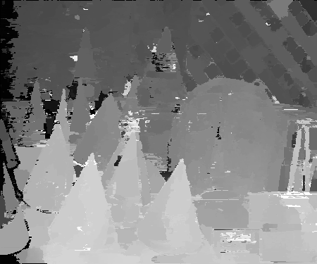

# AD-Census for Rust
AD-Census-rs 是 [AD-Census](https://github.com/ethan-li-coding/AD-Census) 的Rust实现

AD-Census算法来自于中国学者Xing Mei等在ICCV2011发表的论文《On Building an Accurate Stereo Matching System on Graphics Hardware》算法效率高、效果出色，Intel RealSense D400就是基于该算法实现的立体匹配

AD-Census是一个将局部算法和半全局算法相结合的算法，它包含四个步骤：
    1. 初始代价计算
    2. 代价聚合
    3. 扫描线优化
    4. 视差优化


### 示例运行
```
cargo run --example example --release
```

### 结果
| 源图  | 视差图 |
| --- | --- |
|   |  |

### 引用
- 理论说明
    1. [代价计算](https://ethanli.blog.csdn.net/article/details/107743719)
    2. [十字交叉域代价聚合（Cross-based Cost Aggregation）](https://ethanli.blog.csdn.net/article/details/107804210)
    3. [扫描线优化（Scanline Optimization）](https://ethanli.blog.csdn.net/article/details/107825411)
    4. [多步骤视差优化](https://ethanli.blog.csdn.net/article/details/107922958)
- [C++源码](https://github.com/ethan-li-coding/AD-Census)
